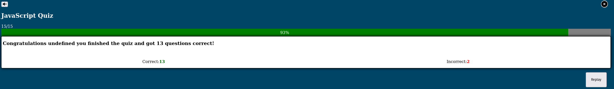

# JavaScript Quiz

This website features a JavaScript quiz designed to provide users with an opportunity to test their knowledge of the basics of the programming language. The quiz aims to offer a learning experience by highlighting the correct answers in green, even when the user selects an incorrect option.

Are you ready for the challenge? <a href="https://dfcmk.github.io/Quiz-Game/">JavaScript Quiz</a>

## Table of Content

- <a href="#user-experience-ux">User Experience UX</a>

 [Site Structure](#site-structure)
  
- <a href="#design-choices">Design Choices</a>

  - [typography](#typography)

  - [Color Scheme](#color-scheme)

- <a href="#features">Features</a>
  - <a href="#existing-features">Existing Features:</a>
    - [Home page](#home-page)
    - [Question cards](#question-cards)
    - [Mute/unmute button](#mute/unmute-button)
    - [Questioncard counter and progressbar](#questioncard-counter-and-progressbar)
    - [Score area](#score-area)
    - [Gamesound](#game-sound)
    - [Game over and Replay menu](#game-over-and-replay-menu)
    - [Results](#results)

  - <a href="#features">Future Features</a>
   
- <a href="#technologies-used">Technologies Used</a>

- [Testing](#testing)

- [Deployment](#deployment)

- [Credits](#credits)

  - [Content](#content)
  
  - [Media](#media)
  
  - [Code](#code)
  
- [Acknowledgements](#acknowledgements)

## User Experience UX

### Site Structure:

The JavaScript Quiz is designed to test and engage users with 15 JavaScript-related questions. It features a homepage with an introduction and a start button, multiple-choice question cards, and results displayed at the end. The game promotes learning by highlighting correct and incorrect answers.

<a href="#table-of-content">Back to top</a>

## Design Choices

### Typography:

No custom fonts were imported for the quiz as it did not appear necessary. The site utilizes default fonts, which were deemed sufficient for the design.

### Color Scheme:

The selected color scheme for the quiz features a blue background with an hsl(--hue) hue, complemented by white question boxes and answer buttons in the same color. This choice was made to maintain focus on the quiz content. The combination of white question boxes and blue buttons enhances the visual harmony with the background while capturing the user's attention effectively.

For a visual representation of the contrast, refer to the screenshot below:
 

<a href="#table-of-content">Back to top</a>

## Features:

The quiz website consists of a homepage with a brief introduction and a start button to initiate the quiz. The main quiz section includes 15 multiple-choice questions, each displaying a question and four possible answers. The game provides immediate feedback by highlighting correct answers in green and incorrect ones in red. At the end of the quiz, the user receives a summary of correct and incorrect answers, along with a congratulatory message. If the user answers incorrectly three times, the quiz ends, and they have the option to retry or return to the homepage. The site also features a mute button for audio control and includes a replay option.

<a href="#table-of-content">Back to top</a>

### Existing Features:
  #### Home page:
  The homepage comprises the game title, a concise introduction to the game and its rules, a start button for initiating the quiz, and a background image designed to pique curiosity about the quiz. 
  
  The screenshots below provide examples of how the homepage would appear on both a laptop and a smartphone.

  

  

  <a href="#table-of-content">Back to top</a>

#### Question cards: 
  
  The question cards feature a clear and user-friendly design. Each card includes a well-formulated question, accompanied by four multiple-choice answers. The chosen color scheme ensures a visually cohesive experience, with white question boxes and hsl(--hue) blue answer buttons, blending seamlessly with the background.
  
  The screenshots below illustrate these design elements on both a laptop and a smartphone for a comprehensive view.

  

  

  <a href="#table-of-content">Back to top</a>

  #### Mute/unmute button: 
  The mute/unmute button serves as a crucial element for sound control within the quiz. Users can easily toggle between muted and unmuted states, providing them with the flexibility to customize their audio experience. This feature ensures a seamless and adjustable sound environment, catering to individual preferences.
  
  The game sound is muted by default to enhance the user experience, as illustrated below:

  

  <a href="#table-of-content">Back to top</a>

  #### Questioncard counter and progressbar:
  The question card counter and progressbar keeps track of the answered questions, providing users with a visual representation of their progress and indicating how many questions remain. 
  The screenshot below illustrates the counter:

  

  #### Score area: 
  The score area tallies both correct and incorrect answers, distinguishing them with green and red colors, respectively. This visual representation helps users monitor their performance throughout the quiz.

  

  <a href="#table-of-content">Back to top</a>

  #### Gamesound: 
  The game sound is carefully selected to evoke a classical quiz ambiance. Click on the icon below to experience it. Additionally, the correct and wrong sounds have been chosen to resemble typical quiz feedback, enhancing the overall quiz experience.

  - Gamesound:
 

  - Wrong answer sound: 

  - Correct answer sound: 
  
<a href="#table-of-content">Back to top</a>
  
  #### Game over and Replay menu:
  When player answered three times incorrectly an alert message plop up to inform the player the he lost the game, see below: 

  

  followed by a replay menu where the Player can play again or quit:

  

  <a href="#table-of-content">Back to top</a>
  
  #### Results:
  Upon completing the quiz, the result section appears, displaying the player's score along with a brief congratulatory message and a replay button:

  

  ### Future Features:
Potential future features include the addition of a submission form to personalize the game experience by getting players' names. Additionally, there could be a fireworks animation with sound effects in the results section, a countdown per question, the inclusion of jokers, an increased number of questions, the implementation of different difficulty levels, and a timer to measure the overall game duration.

<a href="#table-of-content">Back to top</a>

## Technologies Used

- <a href="https://html.spec.whatwg.org/" rel="nofollow">HTML5</a>: Provides the content and structure for the website.

- <a href="https://www.w3.org/Style/CSS/Overview.en.html" rel="nofollow">CSS</a>: Provides the styles for the website.

- <a href="https://developer.mozilla.org/en-US/docs/Web/JavaScript: Provides content and add interactivity to game." rel="nofollow">JavaScript</a>: Provides the interactivity and dynamic behavior for the website.

- <a href="https://github.com/" rel="nofollow">Github</a>:  Used to host and manage the website's source code.

- <a href="https://code.visualstudio.com/ used to deploy the website." rel="nofollow">VS Code</a>: Used as the code editor to write and edit the website's code.

<a href="#table-of-content">Back to top</a>

## Testing

Please refer to <a href="https://github.com/DFCMK/Quiz-Game/blob/main/TESTING.md"><em>here<em></a> for more information on testing the JavaScript quiz.

## Deployment 

This site was depolyed to GitHub pages. The steps to deploy a site are shown below:

1. In the GitHub Repository called <b>Quiz-Game</b> click on the <b>Settings</b> button on the Repoitory navigation menu.

2. In <b>Settings</b> on the left side, go down to the <b>Pages</b> item and click on it.

3. Make sure the <b>Source</b> item is set to: <b>Deploy from a branch</b>

4. at the <b>Branch</b> item underneth the <b>source</b> item, set the branch to main and save it.

5. Once you have selected the main branch, the page will automatically refresh to show a detailed ribbon display indicating that the deployment was successful. If the page does not refresh automatically, refresh it manually.

<a href="#table-of-content">Back to top</a>

To get to the live link of the GitHub repository - click here: <a href="https://dfcmk.github.io/Quiz-Game/">https://dfcmk.github.io/Quiz-Game/</a>

### To Fork the repository on GitHub:

Forking a GitHub repository creates a copy of the repository in your own GitHub account. You can view and modify the copy without affecting the original repository.

To fork a repository:

1. Log in to GitHub and navigate to the repository you want to fork.
2. Click the Fork button in the top-right corner of the page.
3. Select a name for your forked repository.
4. Click the Fork button to create the copy.

Once you have forked a repository, you can clone it to your local computer and start making changes. When you are ready to share your changes, you can create a pull request to the original repository.

<a href="#table-of-content">Back to top</a>

#### To create a local clone of this project:

1. Click the Code tab under the repository's name.
2. Click the clipboard icon in the Clone with HTTPS section to copy the URL.

Once you have copied the URL, you can use a Git client to clone the repository to your local computer.
Here are the steps to clone a repository using Git Bash:

3. Open Git Bash.
4. Navigate to the directory where you want to clone the repository.
5. Type the following command and press Enter:

git clone <URL>

Replace <URL> with the URL of the repository that you copied in step 2.

This will create a local clone of the repository in the current directory.

You also can create and name the directory where the clone should be saved in, with adding the directory name after the <URL>. So the full command would look like this: git clone <URl> XXXX(This is a directory name)

<a href="#table-of-content">Back to top</a>

## Credits

  ### Content:

   - The icons are sourced from <a href="https://fontawesome.com/search?q=swi&o=r&m=free">Font Awesome</a>
   - The background image on the homepage is obtained from <a href="https://pixabay.com/illustrations/question-mark-why-question-5475172/"> pixaby</a>
   - The quiz is based on <a href="https://www.youtube.com/watch?v=riDzcEQbX6k">Web Dev Simplified</a> tutorial video. 
   - Audio elements were implemented using <a href="https://www.learningguild.com/articles/coding-sound-with-javascript-beginner-s-guide/">Mark Lassoff article</a> as a guideline and where downloaded from <a href="https://pixabay.com/sound-effects/search/quiz/">pixaby</a>

   - The score area is inspired by the <a href="https://github.com/DFCMK/Love-Maths/blob/main/index.html">Love Math project</a>

   - The progress bar was built with the <a href="https://www.w3schools.com/howto/howto_js_progressbar.asp">w3schools tutorial</a>

   <a href="#table-of-content">Back to top</a>
   
   ### Media:
   - The audio files for Gamesound, Wrongsound, and Correctsound were obtained from <a href="https://pixabay.com/sound-effects/search/quiz/">pixaby</a>
   
   - The background image on the homepage also came from  <a href="https://pixabay.com/illustrations/question-mark-why-question-5475172/"> pixaby</a>

   <a href="#table-of-content">Back to top</a>

   ### Code: 
   - <a href="https://github.com/DFCMK/Quiz-Game/blob/main/game.html">HTML5</a>:
     - Code for <strong>audio</strong> elements from line 20-32 is based on: <a href="https://www.learningguild.com/articles/coding-sound-with-javascript-beginner-s-guide/">Mark Lassoff's article</a>

     - The <strong>Quiz</strong> section (line:19 & Line:34-36 & Line:40-57) is inspired by: <a href="https://www.youtube.com/watch?v=riDzcEQbX6k">Web Dev Simplified</a>

     Github repository: <a href="https://github.com/WebDevSimplified/JavaScript-Quiz-App/blob/master/index.html">https://github.com/WebDevSimplified/JavaScript-Quiz-App/blob/master/index.html</a>

     - The <strong>Progressbar</strong> (Line:37-39) is based on: <a href="https://www.w3schools.com/howto/howto_js_progressbar.asp">w3schools tutorial</a>

     - The <strong>score area</strong> (line 45-49) is inspired by the  <a href="https://github.com/DFCMK/Love-Maths/blob/main/index.html">Love Math project</a>

  - <a href="https://github.com/DFCMK/Quiz-Game/blob/main/assets/css/style.css">CSS</a>:
    - The CSS rules for: <strong>:root, body, question-box, question, btn-grid, btn, btn:hover, start-btn-quiz, start-btn-home</strong> are inspired by: <a href="https://www.youtube.com/watch?v=riDzcEQbX6k">Web Dev Simplified</a>

    Github repository: <a href="https://github.com/WebDevSimplified/JavaScript-Quiz-App/blob/master/styles.css">https://github.com/WebDevSimplified/JavaScript-Quiz-App/blob/master/styles.css</a>

    - The CSS rules for: <strong>score-area, score, incorrect</strong> are inspired by the: <a href="https://github.com/DFCMK/Love-Maths/blob/main/index.html">Love Math project</a>

    - The CSS rules for: <strong>progress-bar</strong> and mybar are inspired by: <a href="https://www.w3schools.com/howto/howto_js_progressbar.asp">w3schools tutorial</a>
    
    NOTE: The media queries used cover every device width in landscape and portrait because I couldn't get the @media (orientation: landscape) to work for this project without overriding other CSS rules. It is not the best solution, but it solves the problem with landscape mode on mobile devices and tablets.

- <a href="https://github.com/DFCMK/Quiz-Game/blob/main/assets/js/script.js">JavaScript</a>:
  - Function <strong>progressBar</strong> is inspired by: <a href="https://www.w3schools.com/howto/howto_js_progressbar.asp">w3schools tutorial</a>

  - The functions: <strong>nextCard, startGame, Start.addEventListener("click", function() {}), showQuestion,resetState, checkAnswer, question pool(questions)</strong> was inspiered by: <a href="https://www.youtube.com/watch?v=riDzcEQbX6k">Web Dev Simplified</a>

  Github repository: <a href="https://github.com/WebDevSimplified/JavaScript-Quiz-App/blob/master/script.js">https://github.com/WebDevSimplified/JavaScript-Quiz-App/blob/master/script.js</a>

  - The function <strong>updateMuteButton</strong> was inspiered by  <a href="https://www.learningguild.com/articles/coding-sound-with-javascript-beginner-s-guide/">Mark Lassoff's article</a>

  <a href="#table-of-content">Back to top</a>
  
## Acknowledgements:

I extend my thanks to several individuals and communities who contributed to the completion of this project:

- <a href="https://www.linkedin.com/in/precious-ijege-908a00168/">Precious Ijege</a>, my dedicated mentor, for providing valuable guidance and support throughout the development process.

- The entire Code Institute team, whose resources and expertise have been instrumental in my learning journey.

I choose to build a Quiz about JavaScript because i am new to this programming language and i thought it would be beneficial to incude the topic into the quiz so it would promote my learning.

Denes Kalnoky 2023.

<a href="#table-of-content">Back to top</a>
   

 

  

 