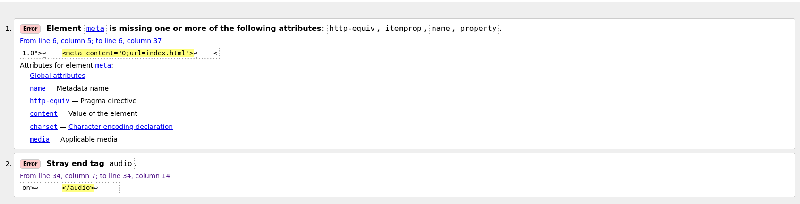
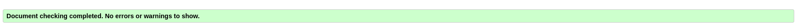
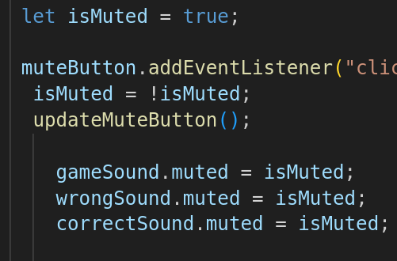
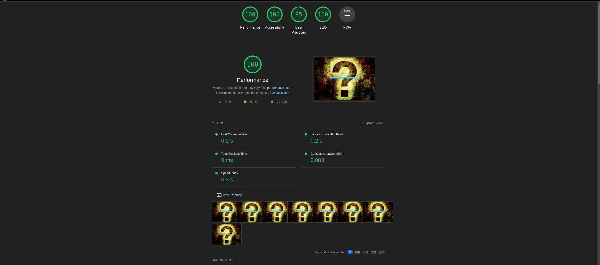
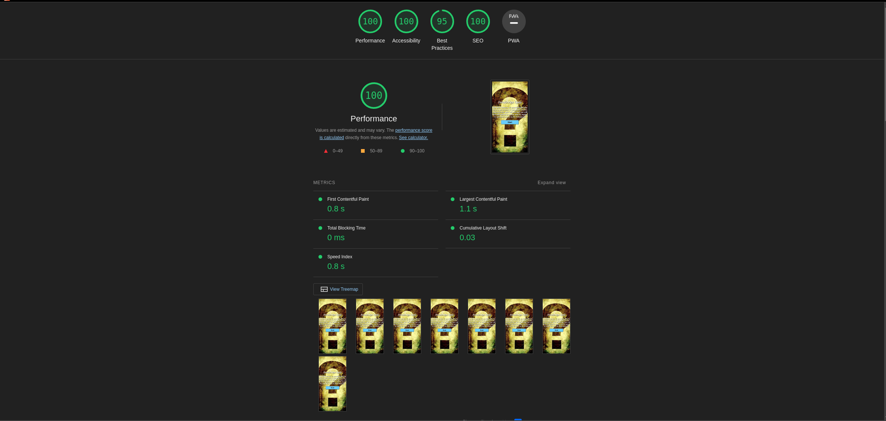

# Testing

## Code Validation

- The JavaScript Quiz website has been thoroughly tested. All of the code has been run through the <a href="https://developer.chrome.com/docs/devtools/">W3C HTML Validator</a>.
The CSS stylesheet got tested also with the <a href="https://developer.chrome.com/docs/devtools/">W3C HTML Validator</a>.
The JavaScript code got Tested with <a href="https://jshint.com/">Jshint</a>.
Minor errors were found on Homepage (index.html). 
There was a extra audio closing tag and a uncomplete meta tag, both got deleted.

You can refer to the screenshots below for encountered errors and theire fixes

#### The HTML validator results for each page are below:

 - Errors on Homepage (index.html):

 

 Results after deleting incomplete meta tag and extra audio closing tag:

 

 - Quiz (game.html):

 

 - The JSHint validator results showed that there were a number of minor warnings but no errors.

#### CSS stylesheet - CSS Validator result:

 

 ## Responsivness Test:
 The responsive design tests were carried out manually with <a href="https://developer.chrome.com/docs/devtools/">Google Chrome DevTools</a> and <a href="https://www.responsivedesignchecker.com/">Responsive Design Checker</a> and <a href="https://www.mozilla.org/en-US/firefox/developer/">Firefox DevTools</a>

 The site passed all Test on the <a href="https://www.responsivedesignchecker.com/">Responsive Design Checker.</a>
 
 Please **Note:**
 
Playing the quiz on a phone with a small screen like the iPhone SE, iPhone 3/4/4s/5/5s could cause issues with loading some of the question cards correctly. If the answers are long, it might cause overflow.

## Browser Compatibility:

JavaScript Quiz was tested on the following browsers with no visible issues for the user. Google Chrome, Ecosia, Safari and Mozilla Firefox. Appearance, functionality and responsiveness were consistent throughout for a range of device sizes and browsers.

## Known Bugs:
  - #### Resolved Bugs:
 There was one issue with the sound icon and the unmute function; I had to press twice on it to update the button to the mute icon, and the game sound only started playing after selecting an answer. I could solve the problem by setting the variable from isMuted = false to isMuted = true. The screenshots below provides some visualization:

 

 

## Additional Testing

 ### Lighthouse:

 The site was also tested using <a href="https://developer.chrome.com/docs/lighthouse/overview/#devtools">Lighthouse</a> in Chrome Developer Tools to test for: 

  - Performance - How the page performs whilst
  loading.
  - Accessibility - Is the site acccessible for all users and how can it be improved
  - Best Practices - Site conforms to industry
  best practices.
  - SEO - Search engine optimisation. Is the site optimised for search engine result rankings.

The Screenshot below show the result for Desktops: 

The Screenshot below show the result for small devices like mobiles:

Back to: <a href="https://github.com/DFCMK/Quiz-Game/blob/main/README.md">README.md</a>